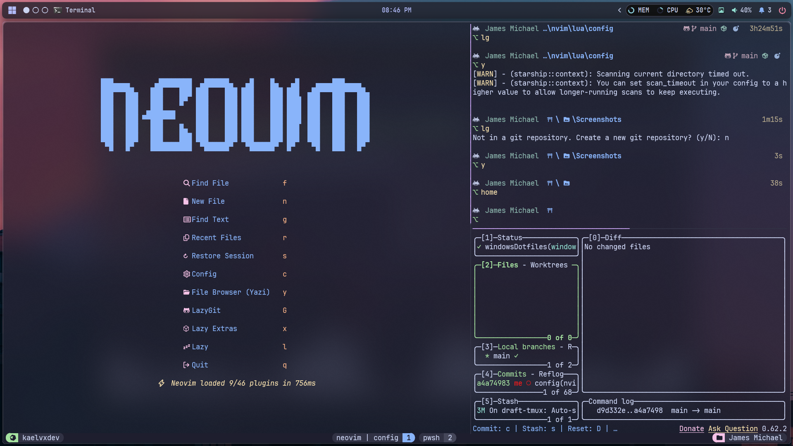
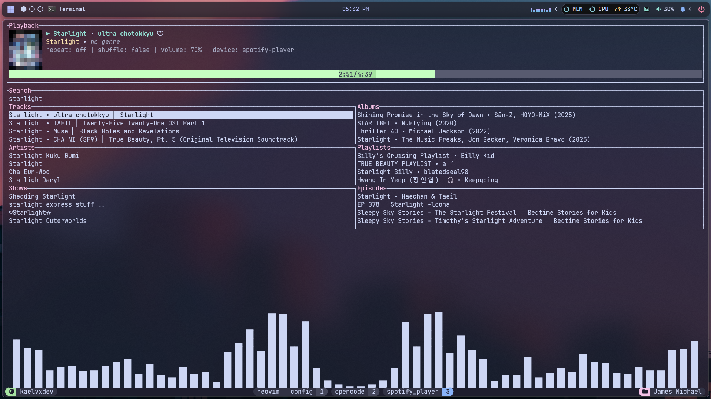
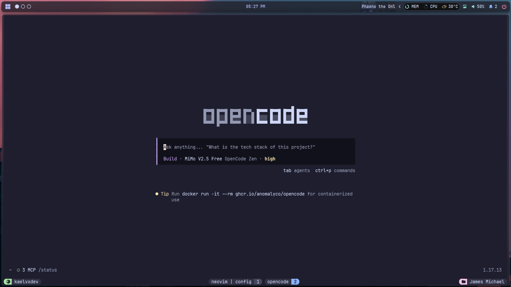
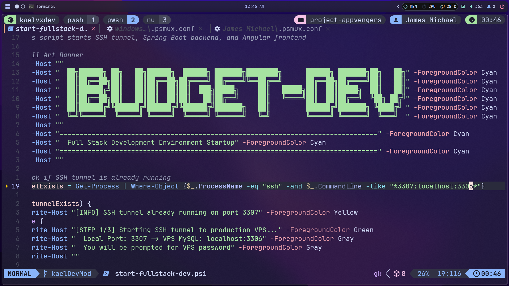

> [!NOTE]
> This repository is now archived. These Windows dotfiles will not receive 
> updates because I have transitioned to using a Linux distribution (Arch).

# windowsDotfiles

A collection of configuration files for customizing the Windows Terminal experience and related productivity tools.

## Overview

This repository contains my personal dotfiles and settings for Windows Terminal and several Windows productivity tools. These configurations are tailored to streamline my workflow, enhance appearance, and optimize productivity on Windows systems. The setup features Komorebi as the tiling window manager and YASB as the custom status bar, creating a cohesive and efficient desktop environment.

**Note:** This README is a work in progress and will be updated with more details and documentation in the future.

## Preview

Here are some screenshots:

check the **[Picture](pictures)** to see more!

## Features

- Custom Windows Terminal settings
- Personalized color schemes and key bindings
- Startup actions and profile settings
- Easy-to-edit and extend configuration files
- Configuration support for:
  - [Komorebi](https://github.com/LGUG2Z/komorebi): Tiling window manager for Windows (komorebic 0.1.41)
  - [YASB](https://github.com/sxyazi/yasb): Custom status bar for Windows (version 1.8.7)
  - [yazi](https://github.com/sxyazi/yazi): Blazing fast terminal file manager (Yazi 26.5.6)
  - [superfile](https://github.com/sxyazi/superfile): Lightweight file explorer (superfile version v1.6.0)
  - [fastfetch](https://github.com/fastfetch-cli/fastfetch): Neofetch-like system info tool (fastfetch 2.64.2 (x86_64))
  - [anifetch](https://github.com/Notenlish/anifetch): Animated system fetch connected to fastfetch (Anifetch 1.0.5)
  - [winfetch](https://github.com/kiedtl/winfetch): Windows system info fetcher
  - [lazygit](https://github.com/jesseduffine/lazygit): Git terminal
  - [Neovim](https://github.com/neovim/neovim): Terminal text editor (NVIM v0.12.3)
  - [psmux](https://github.com/psmux/psmux): Terminal multiplexer, good tmux windows port! (psmux 3.3.1)
  - [television](https://github.com/alexpasmantier/television): A very fast, portable and hackable fuzzy finder (television 0.15.9)
  - [tarts](https://github.com/oiwn/tarts): Screen savers and visual effects for your terminal! (tarts 0.1.25)
  - [spotfy_player](https://github.com/aome510/spotify-player): A Spotify player in the terminal with full feature parity (spotify_player 0.22.1)
  - [LazyVim](https://github.com/LazyVim/LazyVim): Neovim config for the lazy

### Customization

Feel free to edit any configuration file to suit your preferences:

- Change color schemes, font size, or profile settings
- Add custom key bindings or shortcuts
- Adjust window manager layouts and status bar modules (GlazeWM, Zebar)
- Tweak file manager and explorer options (yazi, superfile)
- Edit system info display settings (fastfetch, winfetch)

## License

This project is licensed under the MIT License. See [LICENSE](LICENSE) for details.

## Author

[mejares-jamesmichael](https://github.com/mejares-jamesmichael)

---

_This README will be updated in the future with more detailed instructions and explanations._
